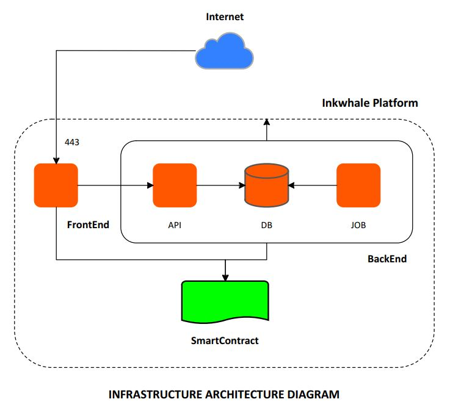
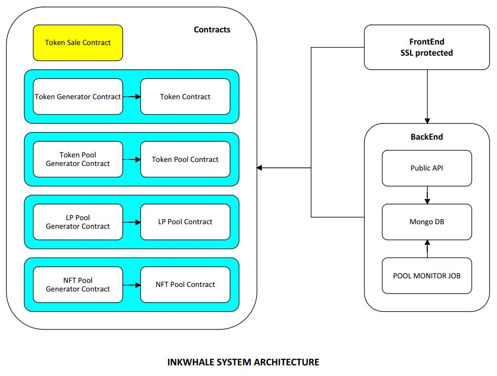

# Inkwhale Technical Doc

- [Inkwhale Technical Doc](#inkwhale-technical-doc)
  - [System Infrastructure](#system-infrastructure)
    - [The FrontEnd](#the-frontend)
      - [Git Repo](#git-repo)
    - [The Contracts](#the-contracts)
      - [Git Repo](#git-repo-1)
      - [Deploy contract and update address abis](#deploy-contract-and-update-address-abis)
      - [Token Sale Contract](#token-sale-contract)
      - [Token Contract](#token-contract)
      - [Token Generator Contract](#token-generator-contract)
      - [Pool Contract](#pool-contract)
      - [Pool Generator Contract](#pool-generator-contract)
      - [LP Pool Contract](#lp-pool-contract)
      - [LP Pool Generator Contract](#lp-pool-generator-contract)
      - [NFT Pool Contract](#nft-pool-contract)
      - [NFT Pool Generator Contract](#nft-pool-generator-contract)
    - [Backend](#backend)
      - [Git Repo](#git-repo-2)
      - [APIs](#apis)
        - [database.js](#databasejs)
        - [api.js](#apijs)
        - [pool.js](#pooljs)

## System Infrastructure



Inkwhale Infrastructure contains 3 different components:

- The FrontEnd
- The Contracts
- The BackEnd

### The FrontEnd
The front-end is the website interface that allows end-users to interact with the contracts. To optimize the speed, some data is fetched directly from API servers.

It is located at https://iw-fe.vercel.app/

#### Git Repo

https://github.com/InkWhale-net/frontend/tree/fe-new-ui

### The Contracts



This is the core component of the whole platform as end-users interact directly to the smart contracts on blockchain to create tokens/staking pools/ lp pools/nft pools and stake/unstake token/nft to/from pools.

#### Git Repo

https://github.com/InkWhale-net/contracts

#### Deploy contract and update address abis
Click here to see in detail [Contract deployment and update address abis file](contract_deployment_and_update_addresses_abis.md) 

#### Token Sale Contract

It is the token of the Inkwhale System called WAL (WHALE), is used for paying related fees (create/stake/unstake token/NFT).

It has its total cap and public minting cap with the corresponding minting fee set in the constructor/during contract initialization by owner using the token_mint_cap::data::Data struct below. 

```
#[derive(Default, Debug)]
#[openbrush::upgradeable_storage(STORAGE_KEY)]
pub struct Data {
    pub cap: Balance,
    pub minting_fee: Balance,
    pub minting_cap: Balance,
    pub total_minted: Balance,
    pub _reserved: Option<()>
}
```

#### Token Contract

It is the contract to manage each token info created by user. The created token follows PSP22 standard but add the faucet method so that user can mint a fixed amount of 1000 token when testing the system. When use uses the faucet function in the frontend, it will call this faucet from the contract side.    

#### Token Generator Contract

Is the contract to create token by users and manange all the token list.

When user utilizes the token creation function in the frontend, it will call the new_token method in this contract which in turn calls the above Token Contract to create the new token. All the token info such as name, symbol, decimal, total supply, creator address and the created token contract address will be stored in the token_manager::data::Token structure and is saved into token_list to manage. The list will be used in frontend to show tokens created by users. 

```
pub struct Token {
    pub name: String,
    pub symbol: String,
    pub decimal: u8,
    pub contract_address: AccountId,
    pub creator: AccountId,
    pub mint_to: AccountId,
    pub total_supply: Balance
}
```

#### Pool Contract

It is the contract for staking pool. User will stake the pool token, get rewards in APY during a specific duration of the pool and can unstake with a fee by WAL token. Owner of the pool can top up or withdraw rewards in the pool.

Its main data is described in the generic_pool_contract::data::Data struct, the common struct used for staking/lp/nft pool (mentioned later) as below

```
pub struct Data {
    pub staking_contract_address: AccountId, // lp_contract_address/psp34_contract_address 
    pub psp22_contract_address: AccountId,
    pub wal_contract: AccountId,
    pub multiplier: Balance,
    pub stakers: Mapping<AccountId, StakeInformation>,
    pub reward_pool: Balance,
    pub total_staked: Balance,
    pub duration: u64,
    pub start_time: u64,
    pub unstake_fee: Balance,
    pub _reserved: Option<()>
}
```
in which:  
```
staking_contract_address: is not used (only for lp and nft pool)
psp22_contract_address: the address of pool token
wal_contract: WAL token address
multiplier: is used here as the APY for the staking pool
stakers: list of staker info (staked value, unclaimed reward, last reward update) 
reward_pool: available reward in the pool
total_staked: total amount of staking token
duration: duration of the pool
start_time: starting time of the pool
unstake_fee: the fee for unstaking
```

#### Pool Generator Contract

Is the contract to create staking pool by users and manage all the staking pool list.

When user utilizes the staking pool creation function in the frontend with a creation fee, it will call the new_pool method in this contract which in turn calls the above Pool Contract to create the new staking pool. All the pool info will be saved into pool_list to manage. The list will be used in frontend to show staking pools created by users. 

Its main data is described in the generic_pool_generator::data::Data struct, the common struct used for staking/lp/nft pool generator (mentioned later) as below

```
pub struct Data {
    pub pool_hash: Hash,
    pub admin_address: AccountId,
    pub pool_count: u64,
    pub wal_contract: AccountId,
    pub creation_fee: Balance,
    pub unstake_fee: Balance,
    pub pool_list: Mapping<u64, AccountId>,
    pub pool_ids: MultiMapping<Option<AccountId>, u64, ValueGuard<AccountId>>,                
    pub pool_ids_last_index: Mapping<Option<AccountId>, u64>,
    pub _reserved: Option<()>
}
```

in which:  
```
pool_hash: The hash of pool contract
admin_address: Not use
pool_count: total number of pools
wal_contract: WAL token address
creation_fee: fee to create a pool
unstake_fee: fee to unstake a pool
pool_list: list of pools
pool_ids: list of pool by user address
pool_ids_last_index: total number of pool by use address 
```

#### LP Pool Contract

It is the contract for LP pool of a token pair (staking and earning tokens). User will stake one token and get rewards of mutipilier earning tokens/day during a specific duration of the pool and can unstake with a fee by WAL token. Owner of the pool can top up or withdraw rewards in the pool.

Its main data is described in the generic_pool_contract::data::Data struct, the common struct used for staking/lp/nft pool as mentioned in the Pool Contract with some below notes:  

```
staking_contract_address: the address of staking token 
psp22_contract_address: the address of earning token
multiplier: number of earning tokens per day
```

#### LP Pool Generator Contract

Is the contract to create LP pool by users and manage all the LP pool list.

When user utilizes the LP pool creation function in the frontend with a creation fee, it will call the new_pool method in this contract which in turn calls the above LP Pool Contract to create the new LP pool. All the pool info will be saved into pool_list to manage. The list will be used in frontend to show LP pools created by users. 

Its main data is described in the generic_pool_generator::data::Data struct, the common struct used for staking/lp/nft pool generator as mentioned in the Pool Generator Contract.

#### NFT Pool Contract

It is the contract for NFT pool. User will stake NFT which follows PSP34 standard and get rewards of mutipilier earning tokens/day during a specific duration of the pool and can unstake with a fee by WAL token. Owner of the pool can top up or withdraw rewards in the pool.

Its main data is described in the generic_pool_contract::data::Data struct, the common struct used for staking/lp/nft pool as mentioned in the Pool Contract with some below notes:  

```
staking_contract_address: the address of NFT 
psp22_contract_address: the address of staking token
multiplier: number of earning tokens per day
```

#### NFT Pool Generator Contract

Is the contract to create NFT pool by users and manage all the NFT pool list.

When user utilizes the NFT pool creation function in the frontend with a creation fee, it will call the new_pool method in this contract which in turn calls the above NFT Pool Contract to create the new NFT pool. All the pool info will be saved into pool_list to manage. The list will be used in frontend to show NFT pools created by users. 

Its main data is described in the generic_pool_generator::data::Data struct, the common struct used for staking/lp/nft pool generator as mentioned in the Pool Generator Contract.

### Backend

The backend is the place to read and write data to the database, including: token, staking pools, LP pools, NFT pools and queue of requests to update the above data to database.

The backend servers are in the private network zone
It is located at https://api-dev.inkwhale.net

#### Git Repo

https://github.com/InkWhale-net/backend

#### APIs

Run as pm2 service on the backend server. These are the core files in the backend service:

- database.js
- api.js
- pools.js

##### database.js

The backend uses MongoDB to keep all records mainly for front-end uses. All table structures can be found in this file.

##### api.js

Described in apis.md file

##### pool.js

Every second, the script will check the request queue and update tokens/staking pools/lp pools/nft pools.

Every minute, the script also check if there are any new tokens, staking/lp/nft pools created and update to database.